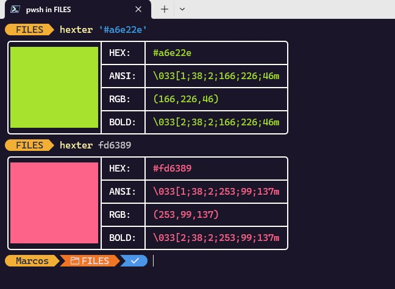

# 🎨 `hexter`
> Get the syntax of a hexadecimal color for the terminal (ANSI RGB)

 

---

## 📦 Dependencies
+ C++ Compiler: [GCC](https://gcc.gnu.org/) or [Clang](https://clang.llvm.org/)
+ [CMake](https://cmake.org/)

---

## 🚧 Build and Install
### Windows
Install Dependencies:
+ [Git](https://winstall.app/apps/Git.Git): `winget install --id=Git.Git  -e`
+ [GCC](https://terminalroot.com/how-to-install-the-new-version-of-gcc-mingw-on-windows/) → *Click on the link to see the procedure*
+ [CMake](https://winstall.app/apps/Kitware.CMake): `winget install --id=Kitware.CMake  -e` 

Open [PowerShell](https://terminalroot.com/customize-your-powershell-like-a-pro/) with **administrator permission**: 
> `Start-Process powershell -Verb runAs`

```bash
git clone https://github.com/terroo/hexter
cd hexter
cmake . -G "Unix Makefiles" -B build -DCMAKE_INSTALL_PREFIX="C:/Program Files/HexTer"
cmake --build build
cmake --install build
[System.Environment]::SetEnvironmentVariable("Path", $env:Path + ";C:\Program Files\HexTer\bin", [System.EnvironmentVariableTarget]::Machine)
```
> Close the terminal and open it again and test: `hexter fd6389`

 


### Unix-like(macOS, GNU/Linux, BSD and Haiku)
```bash
git clone https://github.com/terroo/hexter
cd hexter
cmake . -B build
cmake --build build
sudo cmake --install build
```

---

## 💼 Usage and Examples

```bash
hexter '#a6e22e' # Use quotes or double quotes for '#'
hexter fd6389 # No quotes
```

---

## 🔠 Use API
```cpp
#include <print>
#include "hexter-color.hpp"

int main(){
  std::println("{}Hello, World!{}", hexter::color("#84afd7"), hexter::off);
}
```

If you want to install the API:
```bash
sudo wget -q \
  https://raw.githubusercontent.com/terroo/hexter/refs/heads/main/hexter-color.hpp \
  -O /usr/local/include/hexter-color.hpp
```
> And just include: `#include <hexter-color.hpp>`

> **`hexter`** is still in early versions, if you find any *bugs*, please open an [issue](https://github.com/terroo/hexter/issues).

### Pull requests? 
✅ `hexter` needs Windows compatibility, feel free to submit your PR =).
